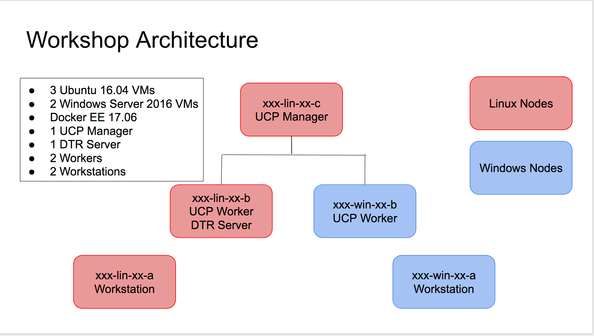
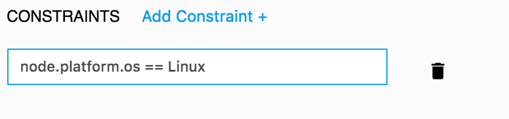

# Deploying Multi-OS applications to Docker EE
Docker EE 17.06 is the first Containers-as-a-Service platform to offer production-level support for the integrated management and security of Linux AND Windows Server Containers.

In this lab we'll build a Docker EE cluster comprised of Windows and Linux nodes. Then we'll deploy both a Linux and Windows web app, as well as a multi-service application that includes both Windows and Linux components.

> **Difficulty**: Intermediate (assumes basic familiarity with Docker)

> **Time**: Approximately 60 minutes

> **Tasks**:
>
> * [Prerequisites](#prerequisites)
> * [Task 1: Build a Docker EE Cluster](#task1)
>   * [Task 1.1: Install the UCP manager](#task1.1)
>   * [Task 1.2: Install a Linux worker node](#task1.2)
>   * [Task 1.3: Install a Windows worker node](#task1.3)
>   * [Task 1.4: Install DTR and Create Two Repositories](#task1.4)
>   * [Task 1.5: Install Self Signed Certs on All Nodes](#task1.5)
> * [Task 2: Deploy a Linux Web App](#task2)
>   * [Task 2.1: Clone the Demo Repo](#task2.1)
>   * [Task 2.2: Build and Push the Linux Web App Image](#task2.2)
>   * [Task 2.3: Deploy the Web App using UCP](#task2.3)
> * [Task 3: Deploy a Windows Web App](#task3)
>   * [Task 3.1: Create the Dockerfile with Image2Docker](#task3.1)
>   * [Task 3.2: Build and Push Your Image to Docker Trusted Registry](#task3.2)
>   * [Task 3.3: Deploy the Windows Web App](#task3.3)
> * [Task 4: Deploy a Multi-OS Application](#task4)
>   * [Task 4.1: Examine the Docker Compose File](#task4.1)
>   * [Task 4.2: Deploy the Application](#task4.2)
>   * [Task 4.3: Verify the Running Application](#task4.3)

## Document conventions

- When you encounter a phrase in between `<` and `>`  you are meant to substitute in a different value.

	For instance if you see `<linux vm dns name>` you would actually type something like `pdx-lin-01.uswest.cloudapp.azure.com`

- When you see the Linux penguin all the following instructions should be completed in one of your Linux VMs

	

- When you see the Windows flag all the subsequent instructions should be completed in one of your Windows VMs.

	


### Virtual Machine Naming Conventions
Your VMs are named in the following convention prefix-os-cluster number-node id.westus2.cloudapp.azure.com

* **Prefix** is a unique prefix for this workshop
* **OS** is either lin for Linux or win for Windows
* **Cluster** number is a two digit number unique to your VMs in this workshop
* **Node ID** is a letter that identifies that node in your cluster

When this guide refers to `<linux node b>` that would be the node with the OS code `lin` and the node ID of `b` (for example `pdx-lin-01-b`>

### Virtual Machine Roles
This lab uses a total of five virtual machines

The Docker EE cluster you will be building will be comprised of three nodes - a Linux manager, a Linux Worker and a Windows worker.

We will also have a linux node and a windows node that will serve as workstations - you'll connect to these machines to do things like build and push docker images.

* The **A** nodes are your workstation nodes
* The **B** nodes are your worker nodes
* The **C** node is you manager node



## <a name="prerequisites"></a>Prerequisites

You will be provided a set of five virtual machines (Two Windows and three Linux), which are already configured with Docker and some base images. You do not need Docker running on your laptop, but you will need a Remote Desktop client to connect to the Windows VM, and an SSH client to connect into the Linux one.
### 1. RDP Client

- Windows - use the built-in Remote Desktop Connection app.
- Mac - install [Microsoft Remote Desktop](https://itunes.apple.com/us/app/microsoft-remote-desktop/id715768417?mt=12) from the app store.
- Linux - install [Remmina](http://www.remmina.org/wp/), or any RDP client you prefer.

### 2. SSH Client

- Windows - [Download Putty](http://www.chiark.greenend.org.uk/~sgtatham/putty/download.html)
- Linux - Use the built in SSH client
- Mac - Use the built in SSH client

> **Note**: When you connect to the Windows VM, if you are prompted to run Windows Update, you should cancel out. The labs have been tested with the existing VM state and any changes may cause problems.

## <a name="task1"></a>Task 1: Build a Docker EE Cluster

In this first step we're going to install Docker Universal Control Plane (UCP) and Docker Trusted Registry. UCP is a web-based control plane for Docker containers that can deploy and manage Docker-based applications across Windows and Linux nodes. Docker Trusted Registry is a private registry server for story your Docker images.

We'll start by installing the UCP manager. Next we'll add a Linux worker node, followed by installing Docker Trusted Registry. Then we'll add a Windows worker node, and finally we'll add our self-signed certs to each of the nodes to ensure they can communicate securely with DTR.

> **Note**: In the current version of UCP manager nodes must be Linux. Worker nodes can be Windows or Linux

### <a name="task1.1"></a>Task 1.1: Install the UCP manager


1. Either in a terminal window (Mac or Linux) or using Putty (Windows) SSH into Linux node **C** using the fully qualified domain name (fqdn). The fqdn should have been provided to you. The username is `docker` and the password is `Docker2017`

	`ssh docker@<linux node c fqdn>`

Start the UCP installation on the current node, and make it your UCP manager.

1.	Pull the latest version of UCP by issuing the following command:

	```
	$ docker image pull docker/ucp:2.2.0
	```

	You should see output similar to below

  	```
	2.2.0: Pulling from docker/ucp
	88286f41530e: Pull complete
	5ee9b2a2067a: Pull complete
	8f1603d2f00b: Pull complete
	Digest: sha256:a41a08269b39377787203517c989a0001d965bb457b45879ab3a7c1e244c9599
	Status: Downloaded newer image for docker/ucp:2.2.0
	```

2.	Install the UCP manager by issuing the following command.

	> **Note**: Be sure to substitute the **Private IP Address** of Linux Node **C** for the `--host-address`

	```
	$ docker container run --rm -it --name ucp \
	-v /var/run/docker.sock:/var/run/docker.sock \
	docker/ucp:2.2.0 install \
	--admin-username docker \
	--admin-password Docker2017 \
	--host-address <linux node c private IP address> \
	--interactive
	```

The installer will pull some images, and then ask you to supply additional subject alternative names (SANs)

4. When prompted for `Additional aliases` you need to supply BOTH the **PUBLIC IP** and **Fully Qualified Domain Name (FQDN)** of Linux Node **C** separated by spaces

	> **Note**: THIS 	STEP IS VERY IMPORTANT PLEASE FOLLOW THESE DIRECTIONS CAREFULLY

	As an example:

	```
	You may enter additional aliases (SANs) now or press enter to proceed with the above list.
  	Additional aliases: 52.183.42.41 pdx-lin-01-c.westus2.cloudapp.azure.com
  	```

You'll see some additional output as the UCP manager is installed


	INFO[0000] Initializing a new swarm at 10.0.2.7
	INFO[0005] Establishing mutual Cluster Root CA with Swarm
	INFO[0008] Installing UCP with host address 10.0.2.7 - If this is incorrect, please specify an alternative address with the '--host-address' flag
	INFO[0008] Generating UCP Client Root CA
	INFO[0010] Deploying UCP Service
	INFO[0058] Installation completed on new-lin-01-c (node iiuinrv3osaoon2meboxojh3x)
	INFO[0058] UCP Instance ID: 6jw827dm4h13kd4nmhc7o10n6
	INFO[0058] UCP Server SSL: SHA-256 Fingerprint=59:8C:C8:AB:37:6E:EF:6C:FB:AA:5E:C5:48:00:27:16:E3:0D:EA:B0:2F:F1:A2:4B:8C:F3:0E:1A:5B:AC:83:F4
	INFO[0058] Login to UCP at https://10.0.2.7:443
	INFO[0058] Username: docker
	INFO[0058] Password: (your admin password)

The next thing we need to do is upload your Docker EE license. For this workshop we are supplying a short-term license, you can download your own 30-day trial license from the Docker Store.

1. Download the [license file](https://drive.google.com/file/d/0ByQd4O58ibOEMkM4bE5XVnJPbEU/view?usp=sharing) to your local laptop

1. Navigate to the UCP console by pointing your browser at `https://<linux node c public ip address>`

> **Note**: You need to use `https:` NOT `http`

> **Note**: Because UCP uses self-signed SSL certs, your web browser may warn you that your connection is not secure. You will need to click through that warning. An example from Chrome is shown below.


2. Log in to UCP with the username `docker` and the password `Docker2017`

3. Click `Upload License`, navigate to your license location, and double-click the license file

Congratulations, you have installed the UCP manager node.

### <a name="task1.2"></a>Task 1.2: Install a Linux worker node

Now that we have a manager node, we'll add a Linux worker node to our cluster. Worker nodes are the servers that actually run our Docker-based applications.

1. From the main UCP dashboard click `Add a node` from the `Add Nodes` box near the bottom left.

	

2. Copy the text from the dark box shown on the `Add Node` screen.

	> **Note** There is an icon in the upper right corner of the box that you can click to copy the text to your clipboard

	

3. SSH into Linux node **B**.

	`ssh docker@<linux node b fqdn>`

4. Paste the text from Step 2 at the command prompt, and press enter.

	You should see the message `This node joined a swarm as a worker.` indicating you've successfully joined the node to the cluster.

5. Switch back to the UCP console in your web browser and click the `x` in the upper right corner to close the `Add Node` window

6. You should be taken to the `Nodes` screen will will see 2 nodes listed at the bottom of your screen. Your **C** node is the manager, and the **B** node is your worker.

Congratulations on adding your first worker node.

In the next step we'll install and configure a Windows worker node.

### <a name="task1.3"></a>Task 1.3: Install a Windows worker node


Let's add our 3rd node to the cluster, a Windows Server 2016 worker node. The process is basically exactly the same as it was for Linux

1. From the Nodes screen, click the blue `Add node` button in the middle of the screen on the right hand side.

> **Note**: You may notice that there is a UI component to select `Linux` or `Windows`. The lab VMs already have the Windows components pre installed, so you do NOT need to select `Windows`. Just leave the selecton on `Linux` and move on to step 2

2. Copy the text from the dark box shown on the `Add Node` screen.

	> **Note** There is an icon in the upper right corner of the box that you can click to copy the text to your clipboard

	

3. Use RDP to log in to Windows node **B**.

4. From the Start menu open a Powershell window

4. Paste the text from Step 2 at the command prompt, and press enter.

	You should see the message `This node joined a swarm as a worker.` indicating you've successfully joined the node to the cluster.

5. Switch back to your web browser and click the `x` in the upper right corner to close the `Add Node` window

6. You should be taken to the `Nodes` screen will will see 3 nodes listed at the bottom of your screen. Your Linux node **C** is the manager, and the **B** Linux and Windows nodes are your workers.

Congratulations on building your UCP cluster. Next up we'll install and configure DTR.

### <a name="task1.4"></a>Task 1.4: Install DTR and Create Two Repositories


Like UCP, DTR uses a single Docker container to bootstrap the install process. In the first step we'll kick off that container to install DTR, and then we'll create two repositories that we'll use later for our Tweet apps we're going to deploy.

1. Switch back to (or reinitiate) your SSH session in to Linux node **C**

2. Pull the latest version of DTR

	`$ docker pull docker/dtr:2.3.0`

	You should see output similar to this:

	```
	2.3.0: Pulling from docker/dtr
	019300c8a437: Pull complete
	e79b5d45af49: Pull complete
	8a7bd66a7244: Pull complete
	f5a08fbc29be: Pull complete
	b39bbe9561c9: Pull complete
	fc937f026406: Pull complete
	e72d13961188: Pull complete
	863b39710b20: Pull complete
	500585597a2b: Pull complete
	Digest: sha256:a473733de1ebadc45cae78ae44907eeef332dff6d029b1575c992118db94cd15
	Status: Downloaded newer image for docker/dtr:2.3.0
	```

3. Run the bootstrap container to install DTR.

	You will need to supply three inputs

	* **--dtr-external URL**: The FQDN of Linux Node **B** (i.e.pdx-lin-01-b.westus2.cloudapp.azure.com)
	* **--ucp-node**: The hostname of Linux Node **B** (This is the first part of the FQDN. For example: pdx-lin-01-b)
	* **--ucp-url**: The URL of the UCP server (Linux node **C**) including the port in the form of `https://<linux c node fqdn>:443` (i.e. https://pdx-lin-01-c.westus2.cloudapp.azure.com:443)


   ```
	$ docker run -it --rm docker/dtr install \
	--dtr-external-url <linux node b FQDN> \
	--ucp-node <linux node b hostname> \
	--ucp-username docker \
	--ucp-password Docker2017 \
	--ucp-url <linux node c / UCP manager URL with port #> \
	--ucp-insecure-tls
	```

	You will see a lot of output scroll by while DTR installs finishing with:

	```
	<output deleted>
	INFO[0160] Successfully registered dtr with UCP
	INFO[0161] Establishing connection with Rethinkdb
	INFO[0162] Background tag migration started
	INFO[0162] Installation is complete
	INFO[0162] Replica ID is set to: 8ec3809e352e
	INFO[0162] You can use flag '--existing-replica-id 8ec3809e352e' when joining other replicas to your Docker Trusted Registry Cluster
	INFO[0185] finished reading output
	```
5. Point your web browser to `https://<linux b fqdn>` and log in with the username `docker` and the password `Docker2017`.

	> **Note**: You need to use `https:` NOT `http`

	> **Note**: Because UCP uses self-signed SSL certs, your web browser may warn you that your connection is not secure. You will need to click through that warning. An example from Chrome is shown below.

Now that DTR is installed, let's go ahead and create a couple of repositories to hold our tweet app images. Repositories are how images are organized within a DTR server. Each image gets pushed to its own repository. Multiple images can be stored within a repository by supplying a different tag to each version.

2. From the left hand menu click `Repositories`

3. Click the green `New repository` button on the right hand side of the screen. This brings up the new repository dialog

4. Under `REPOSITORY NAME` type `linux_tweet_app` and click `Save`

Let's repeat this process to create a repository for our Windows tweet app.

3. Click the green `New repository` button on the right hand side of the screen. This brings up the new repository dialogue.

4. Under `REPOSITORY NAME` type `windows_tweet_app` and click `Save`

Congratulations you've installed Docker Trusted Registry, and have created two new repositories.

### <a name="task1.5"></a>Task 1.5: Install Self Signed Certs on All Nodes

Docker uses TLS to ensure the identity of the Docker Trusted Registry. In a production environment you would use certs that come from a trusted certificate authority (CA). However, by default when you install UCP and DTR they use self-signed certs. These self-signed certs are not automatically trusted by the Docker engine. In order for them to be trusted, we need to copy down the root CA cert from the DTR server onto each node in the cluster. There is a script on each of your nodes that will do this for you

> **Note**: This step is only necessary in POC environments where trusted 3rd party certs are not used

Perform the following steps on all 3 of your Linux nodes (**A**, **B**, **C**)


1. SSH into the Linux node

2. At the command prompt run the `copy_certs` script passing it the fqdn of your linux **B** node.

	`$ ./copy_certs.sh <linux node b fqdn>`

	You should see the following output


		% Total    % Received % Xferd  Average Speed   Time    Time     Time  Current
		100  1988  100  1988    0     0   7216      0 --:--:-- --:--:-- --:--:--  7229
		Updating certificates in /etc/ssl/certs...
		1 added, 0 removed; done.
		Running hooks in /etc/ca-certificates/update.d...
		done.

> **Note**: In some cases you may see some Perl warnings in addition to the above output, these can be safely ignored.

3. Log into the DTR server from the command line to ensure the cert was copied correctly. The username should be `docker` and the password `Docker2017`

	> **Note**: Be sure to substitute the FQDN of your **B** Linux node

	> **Note**: If you see an x509 certificate is from an unknown source error the cert didn't copy correctly, just rerun the above command.

	```
	$ docker login <linux node b fqdn>
	Username: docker
	Password: Docker2017
	```

	You should see a `Login succeeded` message

> **Note**: Remember to repeat these steps on all 3 Linux nodes.


Now we need to do something similar on the two Windows nodes. Perform the following steps on each of the two Windows nodes.

1. RDP into the Windows node

2. From the start menu, open a Powershell window

3. Execute the `copy_certs` script

	`c:\copy_certs.ps1 <linux node b fqdn>`

3. Log into the DTR server from the command line to ensure the cert was copied correctly. The username should be `docker` and the password `Docker2017`

	> **Note**: Be sure to substitute the FQDN of your **B** Linux node

	> **Note**: If you see an x509 certificate is from an unknown source error the cert didn't copy correctly, just rerun the above command.

	```
	$ docker login <linux node b fqdn>
	Username: docker
	Password: Docker2017
	```

	You should see a `Login succeeded` message

> **Note**: Remember to repeat these steps on both Windows nodes.
>
Congratulations, your nodes are now configured to work with your DTR instance.

## <a name="task2"></a>Task 2: Deploy a Linux Web App

Now that we've built our cluster, let's deploy a couple of web apps. These are simple web pages that allow you to send a tweet. One is built on Linux using NGINX and the other is build on Windows Server 2016 using IIS.  

Let's start on the Linux node.

### <a name="task2.1"></a> Task 2.1: Clone the Demo Repo


1. SSH in to your Linux **A** node

2. Make sure you're in your home directory on your Linux VM

	`$ cd ~`

2. Use git to clone the workshop repository.

	```
	$ git clone https://github.com/mikegcoleman/hybrid-workshop.git
	```

	You should see something like this as the output:

	```
	Cloning into 'hybrid-workshop'...
	remote: Counting objects: 13, done.
	remote: Compressing objects: 100% (10/10), done.
	remote: Total 13 (delta 1), reused 10 (delta 1), pack-reused 0
	Unpacking objects: 100% (13/13), done.
	Checking connectivity... done.
	```

	You now have the necessary demo code on your Linux VM.

### <a name="task2.2"></a> Task 2.2: Build and Push the Linux Web App Image


1. Change into the `linux_tweet_app` directory.

	`$ cd ~/hybrid-workshop/linux_tweet_app/`

2. Use `docker build` to build your Linux tweet web app Docker image.

	`$ docker build -t <linux node b fqdn>/docker/linux_tweet_app .`

	The `-t` tells Docker that you're going to store this image in the `docker` repo on your Docker Trusted Registry node

	> **Note**: Feel free to examine the Dockerfile in this directory if you'd like to see how the image is being built.

	Your output should be similar to what is shown below

	```
	Sending build context to Docker daemon  4.096kB
	Step 1/4 : FROM nginx:latest
	latest: Pulling from library/nginx
	ff3d52d8f55f: Pull complete
	b05436c68d6a: Pull complete
	961dd3f5d836: Pull complete
	Digest: sha256:12d30ce421ad530494d588f87b2328ddc3cae666e77ea1ae5ac3a6661e52cde6
	Status: Downloaded newer image for nginx:latest
	 ---> 3448f27c273f
	Step 2/4 : COPY index.html /usr/share/nginx/html
	 ---> 72d22997a765
	Removing intermediate container e262b9220942
	Step 3/4 : EXPOSE 80 443
	 ---> Running in 54e4ff1b39a6
	 ---> 2b5bd87894cd
	Removing intermediate container 54e4ff1b39a6
	Step 4/4 : CMD nginx -g daemon off;
	 ---> Running in 54020cdec942
	 ---> ed5f550fc339
	Removing intermediate container 54020cdec942
	Successfully built ed5f550fc339
	Successfully tagged  <linux node b fqdn>/docker/linux_tweet_app:latest
	```

4. Use `docker push` to upload your image up to Docker Trusted Registry.

	> **Note**: You should still be logged into DTR from the previous steps, but if not you will need to log in again.

	```
	$ docker push <linux node b fqdn>/docker/linux_tweet_app
	```

	The output should be similar to the following:

	```
	The push refers to a repository [new-lin-01-b.westus2.cloudapp.azure.com/docker/linux_tweet_app]
	feecabd76a78: Pushed
	3c749ee6d1f5: Pushed
	af5bd3938f60: Pushed
	29f11c413898: Pushed
	eb78099fbf7f: Pushed
	latest: digest: sha256:9a376fd268d24007dd35bedc709b688f373f4e07af8b44dba5f1f009a7d70067 size: 1363
	```

4. In your web browser head back to your DTR server and click `View Details` next to your `linux_tweet_app` repo to see the details of the repo.

5. Click on `Images` from the horizontal menu. Notice that your newly pushed image is now on your DTR.

### <a name="task2.3"></a> Task 2.3: Deploy the Web App using UCP

Now let's run our application by by creating a new service.

Services are application building blocks (although in many cases an application will only have one service, such as this example). Services are based on a single Docker image. Tasks are the individual Docker containers that execute the application. When you create a new service you instantiate at least one task automatically, but you can scale the number of tasks up to meet the needs of your service.

1. In your web browser navigate to your UCP server (`https://<linux node c fqdn>`)

2. In the left hand menu click `Services`

3. In the upper right corner click `Create Service`

4. Enter `linux_tweet_app` for the name.

4. Under `Image` enter the path to your image which should be `<linux node b fdqn/docker/linux_tweet_app`

5. From the left hand menu click `Scheduling`

6. A few lines down the screen click `Add Constraint+`.

	Constraints are used to tell UCP where to run workloads. They are based on labels - in this specific case we're using a built in label that tells us what OS a given node is running (`node.platform.os`). Since this is a Linux-based container we need to make sure it ends up on a Linux node.

7. Enter `node.platform.os == Linux` into the text field

	

8. From the left hand menu click `Network`

9. Click `Publish Port+`

	We need to open a port for our web server. Since port 80 is already used by UCP on one node, and DTR on the other, we'll need to pick an alternate port. We'll go with 8088.

10. Fill out the port fields as shown below

	

11. Click `Confirm`

12. Click `Create` near the bottom right of the screen.

After a few seconds you should see a green dot next to your service name. Once you see you green dot you can  point your web browser to `http://<linux node c fqdn>:8088` to see your running website.

> **Note**: You want to go to `http://` not `https://`


## <a name="task3"></a>Task 3: Deploy a Windows Web App

Now we'll deploy the Windows version of the tweet app.

### <a name="task3.1"></a> Task 3.1: Create the dockerfile with Image2Docker

There is a Windows Server 2016 VHD that contains our Windows Tweet App stored in `c:\` on your cloud-based VM. We're going to use Image2Docker to scan the VHD, and create a Dockerfile. We'll build the Dockerfile as we did in the previous step, push it to DTR, and then deploy our Windows tweet app.


1. Move back to Windows node **A**, and open a PowerShell window.

2. Use Image2Docker's `ConvertTo-Dockerfile` command to create a dockerfile from the VHD.

	Copy and paste the command below into your Powershell window.

	```
	ConvertTo-Dockerfile -ImagePath c:\ws2016.vhd `
	                     -Artifact IIS `
	                     -OutputPath C:\windowstweetapp `
	                     -Verbose
	```


	* `ImagePath` specifies where the VHD can be found

	* `Artifact` specifies what feature or code to look for

	* `OutputPath` specifies where to write the dockerfile and other items

	* `Verbose` instructs the script to provide extra output.

When the process completes you'll find a dockerfile in `c:\windowstweetapp`


### <a name="task3.2"></a> Task 3.2: Build and Push Your Image to Docker Trusted Registry


1. CD into the directory where your Image2Docker files have been placed.

	`PS C:\Users\docker> cd c:\windowstweetapp\`


2. Use `docker build` to build your Windows tweet web app Docker image.

	`$ docker build -t <linux node b fqdn>/docker/windows_tweet_app .`

	> **Note**: Be sure to use the FQDN for Linux node **B** when you tag the image.

	> **Note**: Feel free to examine the Dockerfile in this directory if you'd like to see how the image is being built.

	Your output should be similar to what is shown below

	```
	PS C:\Users\docker\scm\hybrid-workshop\windows_tweet_app\docker build -t <linux node b fqdn>/docker/windows_tweet_app .

	Sending build context to Docker daemon  6.144kB
	Step 1/10 : FROM microsoft/windowsservercore
	 ---> 590c0c2590e4

	<output snipped>

	Step 10/10 : HEALTHCHECK CMD powershell -command     try {      $response = Invoke-WebRequest http://localhost -UseBasic
	Parsing;      if ($response.StatusCode -eq 200) { return 0}      else {return 1};     } catch { return 1 }
	 ---> Running in ab4dfee81c7e
	 ---> d74eead7f408
	Removing intermediate container ab4dfee81c7e
	Successfully built d74eead7f408
	Successfully tagged <linux node b fqdn>/docker/windows_tweet_app:latest
	```
	> **Note**: It will take a few minutes for your image to build. If it takes more than 5 minutes move into your powershell window and press `Enter`. Sometimes the Powershell window will not update the current status of the build process.

4. Log into Docker Trusted Registry

	```
	PS C:\Users\docker> docker login <linux node b fqdn>
	Username: docker
	Password: Docker2017
	Login Succeeded
	```

5. Push your new image up to Docker Trusted Registry.

	```
	PS C:\Users\docker> docker push <linux node b fqdn>/docker/windows_tweet_app
	The push refers to a repository [<linux node b fqdn>/docker/windows_tweet_app]
	5d08bc106d91: Pushed
	74b0331584ac: Pushed
	e95704c2f7ac: Pushed
	669bd07a2ae7: Pushed
	d9e5b60d8a47: Pushed
	8981bfcdaa9c: Pushed
	25bdce4d7407: Pushed
	df83d4285da0: Pushed
	853ea7cd76fb: Pushed
	55cc5c7b4783: Skipped foreign layer
	f358be10862c: Skipped foreign layer
	latest: digest: sha256:e28b556b138e3d407d75122611710d5f53f3df2d2ad4a134dcf7782eb381fa3f size: 2825
	```

### <a name="task3.3"></a> Task 3.3: Deploy the Windows Web App
Now that we have our Windows Tweet App up on the DTR server, let's deploy it. It's going to be almost identical to how did the Linux version with a couple of small exceptions:

* We will use a constraint to put the workload on a Windows node instead of Linux
* Windows does not currently support ingress load balancing, so we'll exposer the ports in `host` mode using `dnsrr`

1. In your web browser navigate to your UCP server (`https://<linux node c fqdn>`)

2. In the left hand menu click `Services`

3. In the upper right corner click `Create Service`

4. Enter `windows_tweet_app` for the name.

4. Under `Image` enter the path to your image which should be `<linux node b fdqn/docker/windows_tweet_app`

5. From the left hand menu click `Scheduling`

6. A few lines down the screen click `Add Constraint+`.

	Constraints are used to tell UCP where to run workloads. They are based on labels - in this specific case we're using a built in label that tells us what OS a given node is running (`node.platform.os`). Since this is a Linux-based container we need to make sure it ends up on a Linux node.

7. Enter `node.platform.os == windows` into the text field

8. From the left hand menu click `Network`

8. Set the `ENDPOINT SPEC` to `DNS Round Robin`. This tells the service to load balance using DNS. The alternative is VIP, which uses IPVS.

9. Click `Publish Port+`

	We need to open a port for our web server. This app runs on port 80 which is used by DTR so let's use 8082.

10. Fill out the port fields as shown below. **Be sure to set the `Publish Mode` to  `Host`**

	

11. Click 'Confirm'

12. Click `Create` near the bottom right of the screen.

After a few seconds you should see a green dot next to your service name. Once you see you green dot you can  point your web browser to `http://<windows node b fqdn>:8082` to see your running website.

> **Note**: You want to go to your Windows node b, and use `http://` not `https://`

## <a name="task4"></a> Deploying a Multi-OS Application

For our last exercise we'll use a docker compose file to deploy an application that uses a Java front end designed to be deployed on Linux, with a Microsoft SQL Server back end running on windows.

### <a name="task4.1"></a> Task 4.1: Examine the Docker Compose file

We'll use a Docker Compose file to instantiate our application. With this file we can define all our services and their parameters, as well as other Docker primatives such as networks.

Let's look at the Docker Compose file:

```
version: "3.2"

services:

  database:
    image: sixeyed/atsea-db:mssql
    ports:
      - mode: host
        target: 1433
    networks:
     - atsea
    deploy:
      endpoint_mode: dnsrr
      placement:
        constraints:
          - 'node.platform.os == windows'

  appserver:
    image: sixeyed/atsea-app:mssql
    ports:
      - target: 8080
        published: 8080
    networks:
      - atsea
    deploy:
      placement:
        constraints:
          - 'node.platform.os == linux'

networks:
  atsea:
```

There are two services. `appserver` is our web frontend written in Java, and `database` is our Microsoft SQL Server database. The rest of the commands should look familiar as they are very close to what we used when we deployed our tweet services manually.

One thing that is new is the creation of an overlay network (`atsea`). Overlay networks allow containers running on different hosts to communicate over a private software-defined network. In this case, the web frontend on our Linux host will use the `atsea` network to communicate with the database.

You may have used Docker Compose before to deploy multi-service applications, but with swarm we use a slightly different command: `docker stack`.

### <a name="task4.2"></a> Task 4.2: Deploy the Application

1. Move to the UCP console in your web browser

2. In the left hand menu click `stacks`

3. In the upper right click `Create Stack`

4. Enter `atsea` under `NAME`

5. Select `Services` under `MODE`

6. Select `SHOW VERBOSE COMPOSE OUTPUT`

7. Paste the compose file from above into the `COMPOSE.YML` box

8.  Click `Create`

	You will see some output to show the progress of your deployment, and then a banner will pop up at the bottom indicating your deployment was successful.

9. Click `Done`

The UI shows your stack (`atsea`) and that it's comprised of 2 services and 1 network.

1. Click on the `atsea` stack in the list

2. From the right side of the screen choose `Services` under `Inspect Resource`

	

	Here you can see your two services running. It may take a few minutes for the databased service to come up (the dot to turn green). Once it does move on to the next section.


### <a name="task4.3"></a> Task 4.3: Verify the Running Application

1. To see our running web site (an art store) visit `http://<linux node c fqdn>:8080>`

	> **Note**: You want to go to `http://` not `https://`

	The thumbnails you see displayed are actually pulled from the SQL database. This is how you know that the connection is working between the database and web front end.


This concludes our workshop, thanks for attending.
